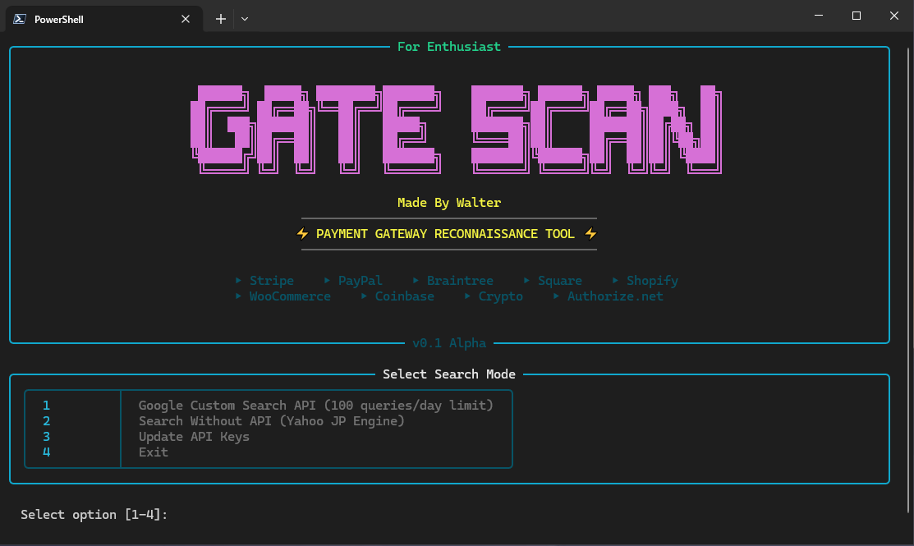
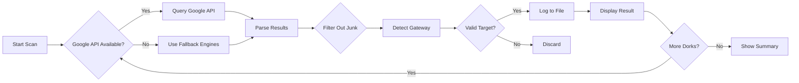

# 🔍 GATE SCAN - Payment Gateway Reconnaissance Tool

<div align="center">


**⚡ Advanced multi-engine search tool for discovering payment gateway implementations across the web**

## Star the repository for future updates

[Features](#-features) • [Installation](#-installation) • [Usage](#-usage) • [Configuration](#-configuration) • [Contributing](#-contributing)

</div>

---



## 📋 Overview

**GATE SCAN** is a powerful Python-based reconnaissance tool that leverages multiple search engines and specialized databases to discover live payment gateway implementations. With an animated, professionally designed terminal UI powered by Rich, it provides real-time scanning with intelligent filtering and dual-output logging. Script is encrypted due to stop it from skids

### 🎯 Supported Payment Gateways

<table>
<tr>
<td>

- ✅ Stripe
- ✅ PayPal
- ✅ Braintree
- ✅ Square

</td>
<td>

- ✅ Shopify Payments
- ✅ WooCommerce
- ✅ Coinbase Commerce
- ✅ Authorize.net

</td>
<td>

- ✅ Adyen
- ✅ Razorpay
- ✅ 2Checkout
- ✅ Crypto Gateways

</td>
</tr>
</table>

---

## ✨ Features

### 🚀 Multi-Engine Search
- **Google Custom Search API** - Primary search with configurable API keys
- **Bing** - Secondary fallback engine
- **Yahoo** - Additional coverage
- **Yahoo Japan** - Japanese market coverage
- **AOL** - Extended reach
- **crt.sh** - SSL certificate transparency logs

### 🎨 Beautiful Animated UI
- **Live Status Dashboard** - Real-time stats with animated borders
- **Color-Coded Results** - Gateway-specific color schemes
- **Progress Tracking** - Visual progress bars and spinners
- **Dual Output Logging** - Separate logs for Google API and Search Engines
- **Wipe-In Banner Animation** - Professional startup screen

### 🛡️ Smart Filtering
- **800+ Blocked Domains** - Filters out documentation, forums, and irrelevant sites
- **Keyword Blacklist** - Removes tutorial/guide/blog URLs
- **Gateway Detection** - Accurate identification of payment implementations
- **Duplicate Prevention** - Intelligent URL deduplication

### 🌐 Advanced Features
- **Proxy Support** - Built-in proxy rotation (optional)
- **Rate Limiting** - Respectful scraping with configurable delays
- **reCAPTCHA Detection** - Automatic CAPTCHA warning system
- **Error Recovery** - Graceful handling of API failures
- **Auto-Fallback** - Switches engines when blocked

---

## 📦 Installation

### Prerequisites
- Python 3.8 or higher
- Windows/Linux/macOS
- Google Custom Search API key (optional but recommended)

### Clone Repository
```bash
git clone https://github.com/walterwhite-69/Gateway-Finder.git
cd Gateway-Finder
```

### Install Dependencies
```bash
pip install rich pycryptodome aiohttp beautifulsoup4 fake-useragent libsql-client cryptography
```

---

## 🚀 Usage

### Quick Start
```bash
python "Gateway scanner.py"
```

### First Run
On first launch, you'll be prompted to enter your **Google Custom Search API credentials**:
- **API Key** - Get from [Google Cloud Console](https://console.cloud.google.com/)
- **Search Engine ID (CX)** - Create at [Programmable Search Engine](https://programmablesearchengine.google.com/)

> **Note:** You can skip this and use fallback search engines (Bing, Yahoo, etc.)

### Configuration File
After setup, credentials are stored in:
```
gate_config.txt
```

---

## 📊 Output Files

### 🔵 GoogleApiResult.txt
Contains results from Google Custom Search API:
```
[2024-01-10 14:32:15] STRIPE
URL: https://example-store.com/checkout
Dork: inurl:checkout stripe -site:github.com
Status: FOUND
```

### 🔴 SearchEnginesResult.txt
Contains results from fallback search engines (Bing, Yahoo, etc.):
```
[2024-01-10 14:35:42] PAYPAL | Engine: Bing
URL: https://donate-site.org/payment
Dork: "paypal.com/sdk/js" inurl:donate
Status: FOUND
```

---

## ⚙️ Configuration

### Search Dorks
The scanner comes pre-configured with 50+ specialized search queries targeting:
- Checkout pages
- Payment forms
- API integrations
- Donation pages
- Subscription systems

### Customizing Dorks
Edit `Gateway scanner.py` and modify the `dorks` dictionary:
```python
'stripe': [
    'inurl:checkout stripe -site:github.com',
    '"pk_live_" -site:stripe.com',
    # Add your custom dorks here
]
```

### Adjusting Filters
Modify blocked domains and keywords in:
```python
BLOCKED_DOMAINS = [
    # Add domains to block
]

BLOCKED_URL_KEYWORDS = [
    # Add keywords to filter
]
```

---

## 🎯 How It Works



---

## 📸 Screenshots

### Animated Banner
The scanner starts with a stunning wipe-in animation featuring:
- Color-cycling "Made By Walter" signature
- Animated border transitions (Blue → Cyan → White)
- Professional double-lined borders

### Live Dashboard
```
╔════════════════════════════════════════════════════════════╗
║              Gateway Scanner Live Status                   ║
╠════════════════════════════════════════════════════════════╣
║  Found: 12   Checked: 847   Blocked: 3   Captcha: 0        ║
║  ─────────────────────────────────────────────────────     ║
║  🔄 Scanning: inurl:checkout stripe -site:github.com       ║
║  📋 Active Dork: Stripe Checkout Integration              ║
╚════════════════════════════════════════════════════════════╝
```

### Found Gateway Card
```
╔════════════════════════════════════════════════════════════╗
║  [STRIPE]                                                  ║
║  https://coolstore.shop/checkout                           ║
║  ─────────────────────────────────────────────────────     ║
║  via: inurl:checkout stripe                                ║
╚════════════════════════════════════════════════════════════╝
```

---

## 🛠️ Troubleshooting

### Google API Blocked
**Symptom:** "Blocked by Google" warnings

**Solutions:**
1. Reduce query rate in code
2. Use proxy rotation
3. Fallback search engines will auto-activate

### No Results Found
**Check:**
- Internet connection
- API credentials validity
- Try different search engines
- Verify dork syntax

### CAPTCHA Warnings
**This means:**
- Search engine detected automation
- Scanner will pause affected engine
- Other engines continue working

---

## 📝 License

This project is licensed under the **MIT License** - see the [LICENSE](LICENSE) file for details.

---

## ⚠️ Disclaimer

This tool is intended for **educational and research purposes only**. 

- Always obtain permission before scanning third-party websites
- Respect `robots.txt` and website terms of service
- Use responsibly and ethically
- The authors are not responsible for misuse

---

## 🤝 Contributing

Contributions are welcome! Please feel free to submit a Pull Request.

### Development Setup
1. Fork the repository
2. Create your feature branch (`git checkout -b feature/AmazingFeature`)
3. Commit your changes (`git commit -m 'Add some AmazingFeature'`)
4. Push to the branch (`git push origin feature/AmazingFeature`)
5. Open a Pull Request

---

## 🙏 Acknowledgments

- **Rich** - Beautiful terminal formatting
- **BeautifulSoup** - HTML parsing
- **aiohttp** - Async HTTP requests
- **Google Custom Search** - Primary search API

---

## 📧 Contact

**Made with ⚡ by Walter**

For questions or support, please open an issue on GitHub.

---

<div align="center">

**⭐ Star this repo if you find it useful! ⭐**

</div>
